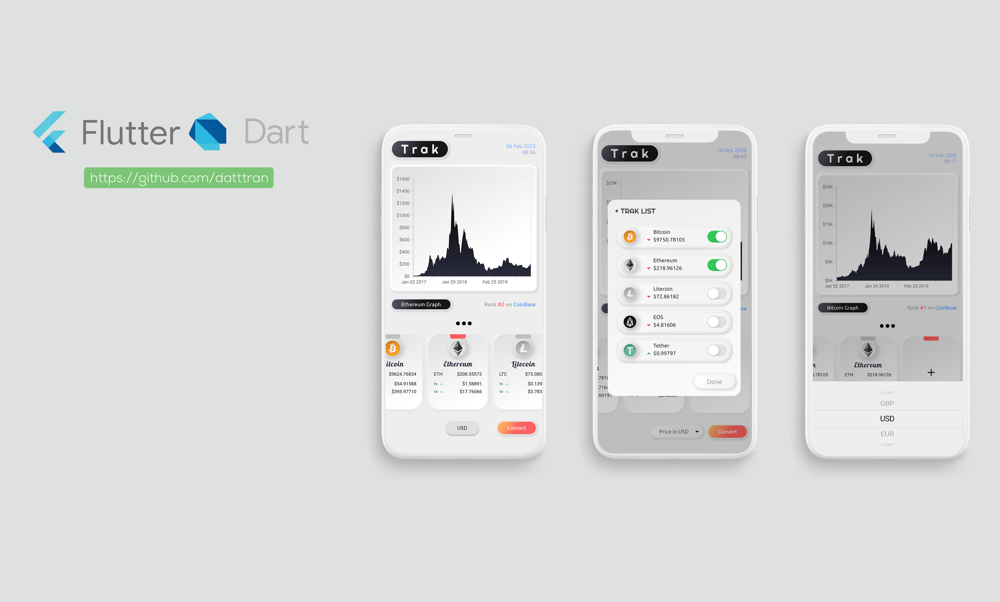

# Trak

A Cryptocurrency price tracker app build with Flutter and Dart.

## Getting Started

1. Install [Flutter](https://flutter.io)
2. Clone the repo
3. From the terminal: Run `flutter pub get` OR 
   From Android Studio/IntelliJ: Click Packages get in the action ribbon at the top of pubspec.yaml.
4. Run `flutter run` (make sure to have an emulator running).

## Recent changes
- Add pinch zooming to the graph.
- Add auto format axis label base on data.
- Add crosshair tool to the graph.
- Update UI.

## Known issues
- App can't start without internet connection since the data is imported using API everytime the app restart.

## Todo

- [ ] Use local currency icons instead the network icons from Nomics. <removed>
- [x] Add "Add card" card to add more cryptocurrency to the watch list.
- [x] Style the graph to match the soft UI theme.
- [x] Add convert function.
- [ ] Add user portfolio.

